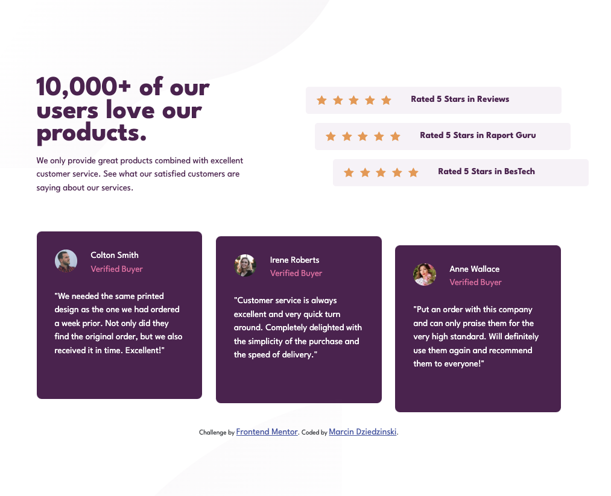

# Frontend Mentor - Social proof section

## Welcome! 👋

This is my solution for the [Frontend Mentor](https://www.frontendmentor.io) challenge called ["Social proof section"](https://www.frontendmentor.io/challenges/social-proof-section-6e0qTv_bA)

## Tools used

- HTML
- CSS
  - Bootstrap 5
  - SaSS

## Live website

- [GitHub Pages](https://mdziedzinski.github.io/social-proof-section/)

Time to finish: 4h
